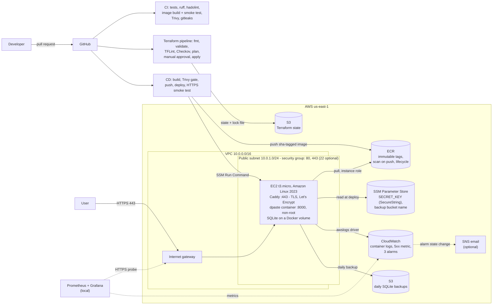
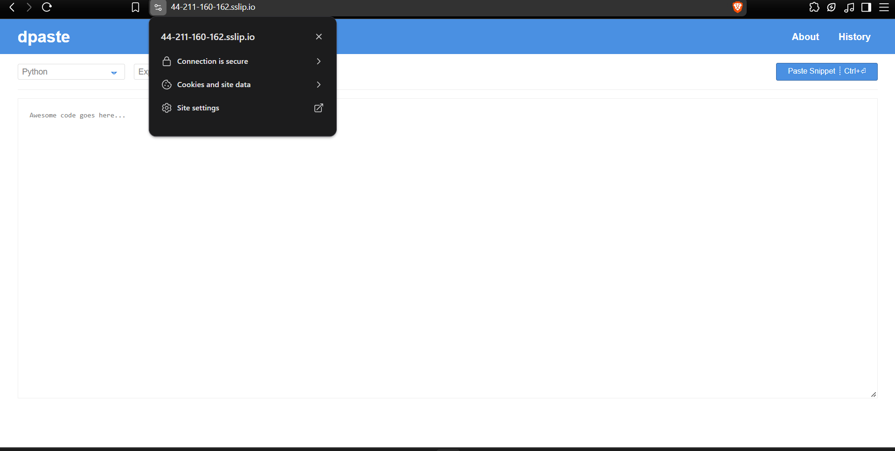
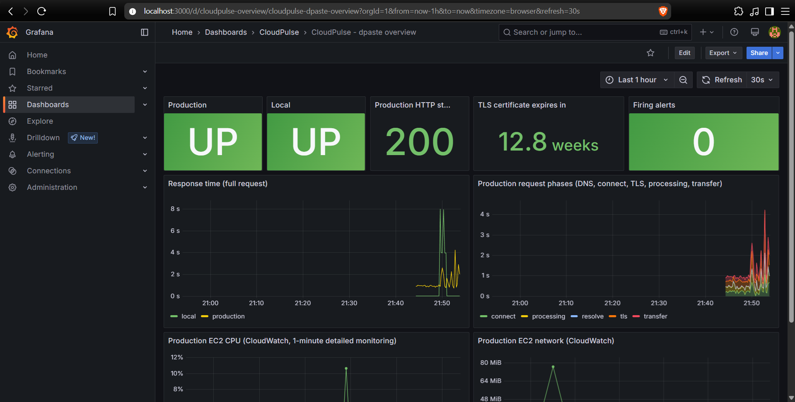
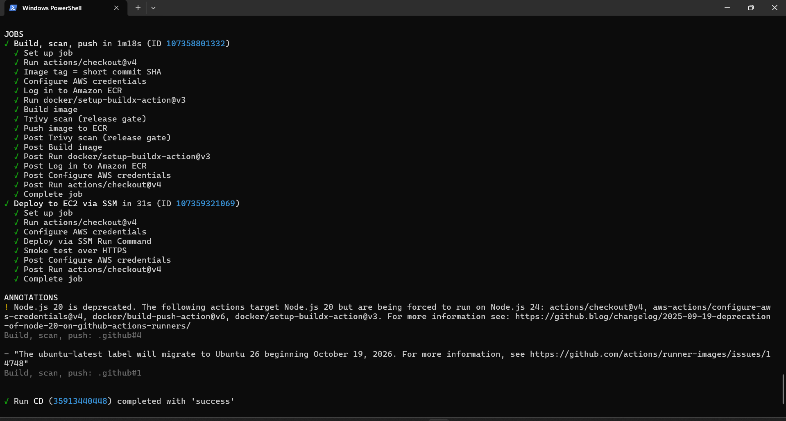
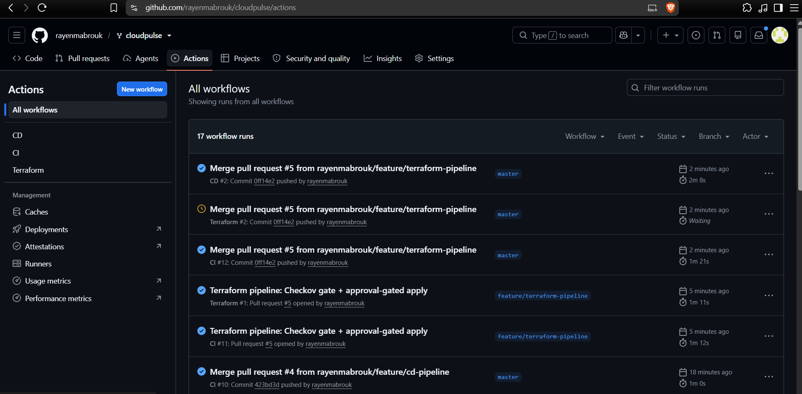
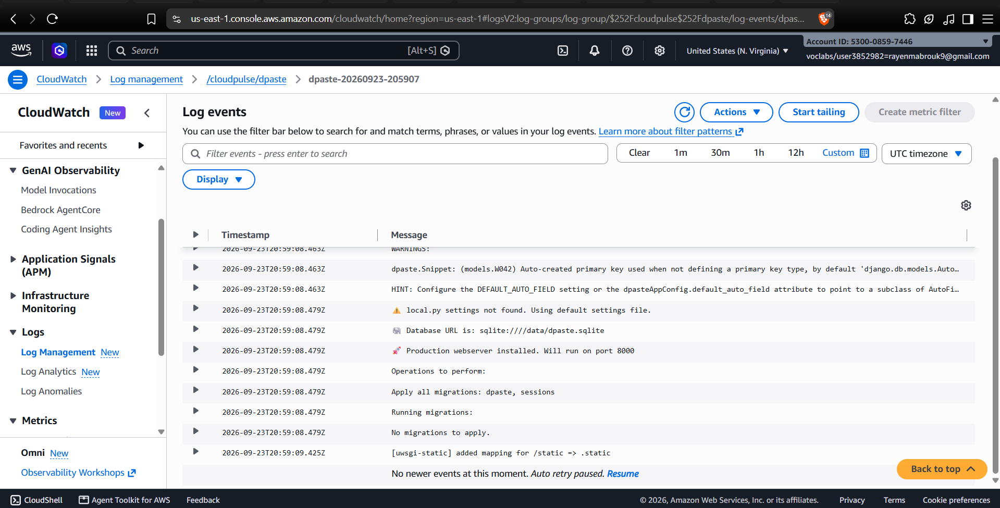

# CloudPulse

An existing open-source web application (dpaste) run on AWS the way a Cloud/DevOps team would: containerised, provisioned with Terraform, delivered by gated CI/CD, secured, backed up and monitored, on a deliberately low-cost architecture.

[](https://github.com/rayenmabrouk/cloudpulse/actions/workflows/ci.yml)
[](https://github.com/rayenmabrouk/cloudpulse/actions/workflows/cd.yml)
[](https://github.com/rayenmabrouk/cloudpulse/actions/workflows/terraform.yml)

> **No permanent URL:** the deployment runs in an AWS Academy Learner Lab, which stops the instance between lab sessions and assigns a new public IP each time. The [evidence](#evidence) section shows the running system.

## Architecture



Everything in the AWS box is created by Terraform, except the Terraform state bucket (bootstrapped by a script, because Terraform cannot store its state in a bucket it has not created yet) and the IAM instance profile (pre-created by AWS Academy).

## What I built

**The application is not mine.** The workload is [dpaste](https://github.com/DarrenOfficial/dpaste) (v3.5, MIT License), a Django pastebin by Martin Mahner and Darren Nathanael. I did not write `dpaste/`, `client/`, `manage.py`, `setup.*`, `package*.json` or `Makefile`. The original README is kept in [`docs/upstream-dpaste-README.md`](docs/upstream-dpaste-README.md). A Cloud/DevOps engineer usually receives an application from a development team and builds everything around it; this repository is that "everything around it".

| Area | What | Where |
|---|---|---|
| Container | 3-stage build (Node assets, Python deps, slim runtime), non-root `dpaste` user, health check. Measured: **369 MB** on disk, **~77 MB** compressed in ECR | `Dockerfile.hardened`, `.dockerignore`, `docker-compose.yml` |
| Infrastructure as Code | Terraform, 3 modules: networking (VPC, subnet, IGW, routes, security groups), compute (EC2, ECR, SSM, backup bucket), monitoring (logs, metric filter, alarms, SNS) | `terraform/` |
| Remote state | S3 backend: versioned, encrypted, public access blocked, TLS-only, S3-native locking | `terraform/backend.tf`, `scripts/bootstrap-tfstate.ps1` |
| Deployment | Pull from ECR with the instance role, secret from SSM, health check, **automatic rollback** to the previous image | `scripts/deploy.sh` |
| HTTPS | Caddy reverse proxy with automatic Let's Encrypt certificates; the app port is bound to localhost only | `scripts/deploy.sh` |
| Backups | Daily online SQLite backup to S3, restore with integrity check | `scripts/backup.sh` |
| CI | Tests, lint, Dockerfile lint, image build + container smoke test, Trivy, secret scan | `.github/workflows/ci.yml` |
| CD | Build -> Trivy gate -> ECR -> deploy through **SSM Run Command** (no SSH keys in CI) -> HTTPS smoke test | `.github/workflows/cd.yml` |
| Infra pipeline | PR: fmt, validate, TFLint, Checkov, plan. Merge: plan -> **manual approval** -> apply the saved plan | `.github/workflows/terraform.yml` |
| Observability | CloudWatch logs, HTTP 5xx metric and alarm, status and CPU alarms; local Prometheus + blackbox exporter + Grafana probing production | `terraform/modules/monitoring/`, `monitoring/` |
| Operations docs | Runbook, troubleshooting (15 real issues), cost analysis | `docs/` |

## Technology stack

AWS (VPC, EC2, ECR, S3, SSM, CloudWatch, SNS) · Terraform · Docker · Caddy · GitHub Actions · Trivy · Checkov · TFLint · hadolint · gitleaks · Prometheus · Grafana · Bash / PowerShell

## Infrastructure

| Component | Why it exists |
|---|---|
| **VPC + public subnet + internet gateway** | Isolated network with a single public subnet. No NAT gateway: the only instance needs a public IP anyway, and NAT would cost more than the rest of the stack combined. |
| **Security group** | Inbound 443 (HTTPS) and 80 (HTTP -> HTTPS redirect and Let's Encrypt challenge) only. SSH (22) is **off by default** and can be opened to a single `/32` for break-glass access. The default security group is emptied so nothing can use it by accident. |
| **EC2 t3.micro (Amazon Linux 2023)** | Runs Docker: Caddy and the dpaste container. IMDSv2 required, encrypted gp3 root volume, 1-minute monitoring. |
| **ECR** | Private registry. Tags are the commit SHA and **immutable**, scan on push, lifecycle policy keeps the 10 newest images. |
| **SSM Parameter Store** | Django `SECRET_KEY` generated by Terraform and stored as a `SecureString`; read by the instance at deploy time, never in Git, the image or CI. |
| **SSM Run Command** | How CD deploys and how operators run commands: no inbound port, no SSH key distributed, every command audited. |
| **S3 (state)** | Terraform remote state with versioning, encryption and native lock file. |
| **S3 (backups)** | Daily SQLite backups: versioned, SSE-S3, TLS-only, public access blocked, 14-day expiry. The EBS volume is otherwise the only copy of the data. |
| **CloudWatch** | Container logs from dpaste and Caddy (`awslogs` driver, 7-day retention), a metric filter counting HTTP 5xx in Caddy's access logs, and three alarms (below). |
| **SNS (optional)** | Email notification for alarm state changes when `alarm_email` is set. |

**Alarms and what they detect**

| Alarm | Fires when | Detects |
|---|---|---|
| `cloudpulse-status-check` | EC2 status check fails for 2 x 5 min | Host, network or OS failure |
| `cloudpulse-cpu-high` | CPU > 80 % for 10 min | Sustained load; a t3.micro will run out of CPU credits |
| `cloudpulse-http-5xx` | >= 5 HTTP 5xx responses in 5 min | Application failure. When the dpaste container is down, Caddy answers **502**, which the EC2 status check cannot see |

## Security

- **Network:** only 80/443 are public; the app listens on `127.0.0.1:8000` and a private Docker network; SSH closed unless explicitly enabled (and `0.0.0.0/0` is rejected by variable validation).
- **Access:** deployments and shell access through SSM, not SSH. IMDSv2 required (mitigates SSRF credential theft).
- **Secrets:** generated by Terraform, stored encrypted in SSM, written on the instance to a root-only env file (`umask 077`). The ECR credential helper avoids storing a registry token on disk. No credentials in Git (checked by gitleaks over the full history on every PR).
- **Encryption:** EBS, both S3 buckets and CloudWatch Logs encrypted at rest; S3 bucket policies deny non-TLS requests; public HTTPS with Let's Encrypt.
- **Container:** non-root user, minimal runtime image (no compilers, no Node), health check, dpaste's own CSP / CSRF / secure-cookie / clickjacking headers left enabled.
- **Supply chain:** third-party GitHub Actions pinned to commit SHAs, downloaded tool binaries verified by SHA-256, Dependabot for actions, base images, Terraform providers and pip. CD configures AWS credentials only **after** the image has passed the Trivy scan.
- **Gates:** Trivy blocks any fixable CRITICAL/HIGH vulnerability in CI and CD; Checkov (47 passed, 0 failed, 17 skipped, each skip justified inline) and TFLint gate Terraform; hadolint gates the Dockerfile; infrastructure changes need my approval before apply; `master` is branch-protected.
- **Accepted risks:** see [AWS Academy limitations](#aws-academy-limitations). `.trivyignore` lists four CVEs in the base image's bundled setuptools (build tooling, not application code). ECR's own scan also reports CRITICAL/HIGH findings in Debian base packages that have no fixed version yet; Trivy's policy blocks only fixable ones, and a base-image rebuild picks up fixes as Debian releases them.

**IAM.** The Learner Lab forbids creating IAM roles, so the instance uses the broad, pre-created `LabRole`. In a real account the instance role would only allow: `ecr:GetAuthorizationToken` plus pull actions on this repository, `ssm:GetParameter` on `/cloudpulse/*`, `logs:CreateLogStream`/`PutLogEvents` on the log group, `s3:PutObject`/`GetObject`/`ListBucket` on the backup bucket, and `AmazonSSMManagedInstanceCore`. GitHub Actions would assume an OIDC role scoped to this repository instead of using session credentials.

## CI/CD

| Change | Path to production |
|---|---|
| Application, image or on-instance scripts | PR -> **CI** -> merge -> **CD**: build `cloudpulse:<sha>`, Trivy gate, push to ECR, send `deploy.sh` + `backup.sh` via SSM, health check with automatic rollback, HTTPS smoke test |
| Infrastructure (`terraform/`) | PR -> CI + **Terraform checks** (fmt, validate, TFLint, Checkov, plan in the run summary) -> merge -> plan -> **waits for approval** -> apply exactly the reviewed plan |

**CI jobs** (every PR and push): `test` (pytest, Python 3.10 like the image), `lint` (ruff, blocking), `docker-build-scan` (hadolint, build, run the container and require: health check `healthy`, non-root UID, `GET /` 200, API accepts a snippet; then Trivy), `secret-scan` (gitleaks, full history). `test`, `lint` and `docker-build-scan` are required checks.

**Why deployment is only partly automated:** the Learner Lab issues session credentials that expire after about 4 hours and cannot create an OIDC provider. CD and the Terraform pipeline read those credentials from GitHub secrets, refreshed at the start of each lab session with `scripts/refresh-github-aws-secrets.ps1`. Outside a lab session, CD and Terraform runs fail at the AWS login step; CI does not need AWS and always runs.

## Local development

Requires Docker. From the repository root:

```bash
docker compose up --build -d            # hardened image, http://localhost:8000
docker compose ps                        # STATUS shows (healthy) after ~30 s
curl -X POST -d "content=hello&lexer=python" http://localhost:8000/api/   # returns the snippet URL
docker compose down                      # add -v to delete the local database volume
```

Tests without Docker (Python 3.10, the image's version):

```bash
python3.10 -m venv .venv && . .venv/bin/activate    # Windows: .venv\Scripts\activate
pip install -e ".[dev]"
pytest dpaste/                                      # 51 tests
ruff check dpaste/
```

On Windows PowerShell 5, use `curl.exe` (plain `curl` is an alias for `Invoke-WebRequest`).

Monitoring stack (Prometheus, blackbox exporter, Grafana): see [runbook section 6](docs/deployment-runbook.md#6-monitoring-stack-local-verified).

## AWS deployment

Full procedure, including GitHub environments and branch protection: [`docs/deployment-runbook.md`](docs/deployment-runbook.md). Short version (PowerShell, repository root, Terraform >= 1.10, AWS CLI v2, GitHub CLI):

```powershell
# 1. Every lab session: Start Lab, paste credentials into ~/.aws/credentials, then
aws sts get-caller-identity
powershell -ExecutionPolicy Bypass -File scripts\refresh-github-aws-secrets.ps1

# 2. Once: remote state bucket
powershell -ExecutionPolicy Bypass -File scripts\bootstrap-tfstate.ps1

# 3. Infrastructure (optional settings in terraform.tfvars, see terraform.tfvars.example)
terraform -chdir=terraform init
terraform -chdir=terraform plan -out=tfplan
terraform -chdir=terraform apply tfplan

# 4. Build, scan, push and deploy the current master through CD
gh workflow run cd.yml --repo rayenmabrouk/cloudpulse
terraform -chdir=terraform output app_url
```

In a different AWS account, pass the state bucket at init time: `terraform init -backend-config="bucket=cloudpulse-tfstate-<account-id>"`.

## Verification

| What | Command | Expected |
|---|---|---|
| Terraform formatting | `terraform -chdir=terraform fmt -check -recursive` | no output |
| Terraform validity | `terraform -chdir=terraform init -backend=false` then `terraform -chdir=terraform validate` | `Success!` |
| Terraform lint / security | `tflint --chdir=terraform --recursive` and `checkov -d terraform --framework terraform --quiet` | no issues; 0 failed checks |
| Drift | `terraform -chdir=terraform plan` | `No changes` |
| Dockerfile | `hadolint Dockerfile.hardened` | no warnings |
| Container health | `docker inspect -f "{{.State.Health.Status}}" <container>` | `healthy` |
| Non-root | `docker compose exec app id -u` | not `0` |
| Deployed app | `curl.exe -sI (terraform -chdir=terraform output -raw app_url)` | `HTTP/1.1 200`, valid certificate |
| Instance managed by SSM | `aws ssm describe-instance-information --query "InstanceInformationList[].[InstanceId,PingStatus]"` | `Online` |
| Logs | `aws logs tail /cloudpulse/dpaste --since 15m` | dpaste startup lines and Caddy JSON access logs |
| Alarms | `aws cloudwatch describe-alarms --alarm-name-prefix cloudpulse --query "MetricAlarms[].[AlarmName,StateValue]" --output table` | 3 alarms, `OK` |
| Backups | `aws s3 ls s3://$(terraform -chdir=terraform output -raw backup_bucket_name)/sqlite/` | one object per day |
| Local monitoring | http://localhost:9090/targets and Grafana http://localhost:3000 | local and production probes `UP` |

**Verified in AWS** (executed and observed, not just configured): CD deploys through SSM; **automatic rollback** after a deliberately broken image (production kept serving 200); data persisted across container replacement; Terraform apply paused for approval and applied the exact plan; `DpasteDown` fired in Prometheus/Grafana when the container stopped and resolved after restart; CloudWatch received container logs.

**Added after that verification and not yet exercised in AWS:** SQLite backups to S3 and restore, the HTTP 5xx metric filter and alarm, SNS notifications, the ECR lifecycle policy, the optional SSH rule, and the updated CI/CD workflows. The runbook marks them `[not yet verified]`.

## Cost considerations

The whole stack is about **$16 per month if left running 24/7** (us-east-1 on-demand prices); in practice the Learner Lab stops the instance between sessions, so actual spend is a fraction of that. Breakdown and decisions: [`docs/cost.md`](docs/cost.md).

Resources that incur charges: the **EC2 instance** (~$7.60/month), its **public IPv4 address** ($3.65), the **EBS volume** ($1.60), **detailed monitoring** (~$2.10), **3 alarms + 1 custom metric** (~$0.60), CloudWatch Logs ingestion, and ECR / S3 storage (cents). Not used, deliberately: NAT gateway, load balancer, RDS, EKS, Route 53, customer-managed KMS keys.

To stop all charges: `terraform -chdir=terraform destroy` (ECR images and the backup bucket are force-deleted; the state bucket is removed by hand, see the runbook).

## AWS Academy limitations

| Limitation | Consequence | In a real account |
|---|---|---|
| Session credentials expire after ~4 h | GitHub secrets refreshed every session; CD/Terraform runs fail outside sessions | OIDC role for GitHub Actions |
| `iam:CreateRole` and `iam:CreateOpenIDConnectProvider` denied | Broad `LabRole` instead of a least-privilege instance role; no OIDC; no VPC flow logs, S3 replication or DLM snapshot policies (all need a service role) | Dedicated least-privilege roles |
| Instance stopped between sessions, new public IP on start | sslip.io hostname changes; a redeploy regenerates the certificate and `ALLOWED_HOSTS` | Elastic IP + Route 53 domain |
| Regions limited to us-east-1 / us-west-2, small instance types only | Single region, t3.micro | Region chosen for users/data residency |
| $50 total credit | No load balancer, NAT or managed database | See engineering decisions |

## Project structure

```
.
├── Dockerfile.hardened        # 3-stage, non-root production image
├── docker-compose.yml         # local run of the hardened image
├── terraform/
│   ├── main.tf, variables.tf, outputs.tf, providers.tf, backend.tf
│   └── modules/
│       ├── networking/        # VPC, subnet, IGW, routes, security groups
│       ├── compute/           # EC2, ECR + lifecycle, SSM secret, backup bucket
│       └── monitoring/        # log group, 5xx metric filter, alarms, SNS
├── scripts/
│   ├── deploy.sh              # runs on EC2: pull, secret, health check, rollback, Caddy, timers
│   ├── backup.sh              # runs on EC2: SQLite backup / list / restore
│   ├── bootstrap-tfstate.ps1  # one-time state bucket creation
│   └── refresh-github-aws-secrets.ps1
├── monitoring/                # Prometheus, blackbox exporter, Grafana (local)
├── .github/workflows/         # ci.yml, cd.yml, terraform.yml
├── docs/                      # runbook, troubleshooting, cost, screenshots
└── dpaste/, client/, ...      # inherited application (not my code)
```

## Engineering decisions

- **EC2 + Docker instead of EKS or ECS.** One small container does not justify a $73/month control plane or a load balancer. The deploy script provides what matters at this scale: immutable images, health checks and automatic rollback.
- **SQLite instead of RDS (or DynamoDB).** dpaste is built on Django's relational ORM and designed for SQLite; RDS would roughly double the cost and DynamoDB would mean rewriting the data layer. The trade-off is a stateful instance, which is why daily S3 backups exist. Production would use RDS PostgreSQL and a stateless app tier.
- **SSM instead of SSH.** No inbound port, no key to distribute to CI, commands logged. SSH remains available as an opt-in break-glass rule restricted to one IP.
- **Caddy on the instance instead of ALB + ACM.** Automatic Let's Encrypt HTTPS for free; HTTPS was required because dpaste sets secure cookies (CSRF fails over plain HTTP).
- **S3-native state locking instead of a DynamoDB lock table.** Terraform >= 1.10 locks with a lock file in the state bucket; one fewer resource, and DynamoDB-based locking is deprecated.
- **Multi-stage build, non-root runtime.** Node and compilers stay in build stages; the runtime image holds only Python, the app and its static files, and runs as an unprivileged user.
- **Terraform with a gated pipeline instead of console clicks.** Every change is reviewed as a plan, scanned, approved, and the exact reviewed plan is applied.
- **Public subnet, no NAT.** Saves ~$32/month; the security group and localhost-bound app limit exposure. Production would use private subnets behind a load balancer, with VPC endpoints.
- **Black-box monitoring.** Prometheus probes the public URL (availability, latency, TLS expiry) without changing the application; CloudWatch covers the AWS side.
- **Backups to S3 from the instance instead of EBS snapshot policies.** Data Lifecycle Manager needs its own IAM role, which the lab forbids; the SQLite online-backup API gives a consistent copy without stopping the app.

## How this was built

I built this project with an AI assistant (Claude) as a pair programmer. It proposed designs and drafted code, commands and parts of this documentation. I ran the commands, reviewed the Terraform plans and pull requests, worked through the failures, and made the final decisions.

## Evidence

Screenshots are in [`docs/screenshots/`](docs/screenshots/).

| | |
|---|---|
| HTTPS site with valid certificate |  |
| Grafana: probes + CloudWatch |  |
| CD pipeline run |  |
| Terraform apply waiting for approval |  |
| Automatic rollback: container started by the rollback, same database |  |

## License

- dpaste application code: MIT License, (c) the dpaste authors (see [`LICENSE`](LICENSE)).
- Infrastructure, pipelines, scripts and documentation added in this repository: MIT License, (c) Rayen Mabrouk.
