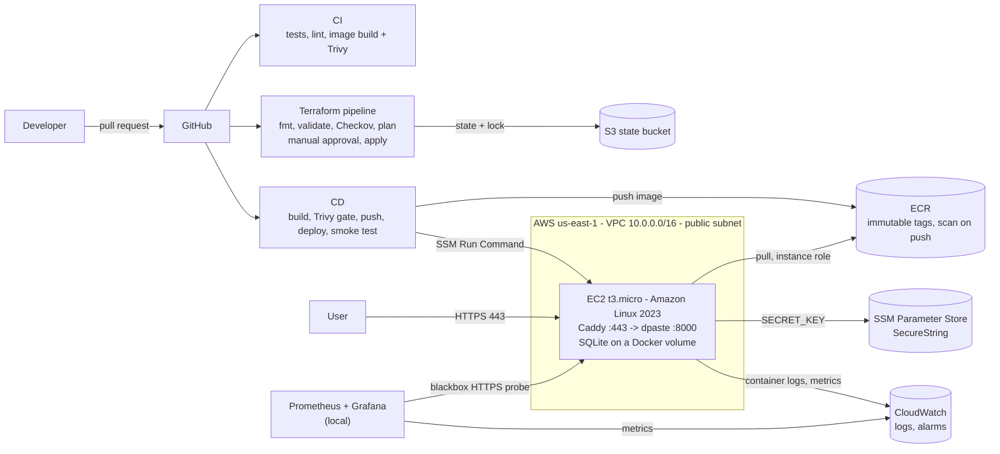

# CloudPulse

**Taking an existing web application and running it on AWS the way a Cloud/DevOps team would:** containerised, provisioned with Terraform, delivered by CI/CD, secured, and monitored.

> **Live demo:** the app runs in an AWS Academy Learner Lab, which stops the server between lab sessions and gives it a new public IP each time, so there is no permanent URL. The [evidence](#evidence) section shows the running system.

---

## The application is not mine

The workload is **[dpaste](https://github.com/DarrenOfficial/dpaste)** (v3.5, MIT License), a Django pastebin created by Martin Mahner and Darren Nathanael. **I did not write the application code** (`dpaste/`, `client/`, `manage.py`, `setup.*`, `package*.json`, the original `Dockerfile` and `docker-compose.yml`). The original README is kept in [`docs/upstream-dpaste-README.md`](docs/upstream-dpaste-README.md).

That is deliberate: a Cloud/DevOps engineer usually receives an application from a development team and builds everything around it. This repository is that "everything around it".

## What I built

| Area | What | Where |
|---|---|---|
| **Container** | Hardened 3-stage Dockerfile: Node build stage for static assets, Python build stage, slim runtime; non-root `dpaste` user; health check. Measured: **369 MB** on disk, **~77 MB** compressed in ECR | `Dockerfile.hardened`, `.dockerignore`, `.trivyignore` |
| **Infrastructure as Code** | Terraform, 3 modules (networking, compute, monitoring): VPC, public subnet, IGW, security groups, EC2, ECR, SSM parameter, CloudWatch log group and alarms | `terraform/` |
| **Remote state** | S3 backend: versioned, encrypted, public access blocked, TLS-only bucket policy, S3-native state locking. Bucket bootstrapped outside Terraform | `terraform/backend.tf`, `scripts/bootstrap-tfstate.ps1` |
| **Deployment** | Deploy script run on the instance: pulls the image from ECR with the instance role, injects the secret from SSM, health-checks, and **rolls back automatically** to the previous image on failure | `scripts/deploy.sh` |
| **HTTPS** | Caddy reverse proxy with automatic Let's Encrypt certificates (sslip.io hostname); the app port is not exposed publicly | `scripts/deploy.sh` |
| **CI** | Tests (pytest), lint (ruff), image build + Trivy scan on every PR | `.github/workflows/ci.yml` |
| **CD** | On merge: build -> Trivy gate -> push to ECR -> deploy via **SSM Run Command** (no SSH keys in CI) -> HTTPS smoke test | `.github/workflows/cd.yml` |
| **Infra pipeline** | On PR: `fmt` -> `validate` -> **Checkov** -> `plan`. On merge: plan -> **manual approval** -> apply the exact saved plan | `.github/workflows/terraform.yml` |
| **Operations** | Daily expired-snippet cleanup (systemd timer), ECR credential helper (no registry token on disk), branch protection | `scripts/deploy.sh` |
| **Monitoring** | Prometheus + blackbox exporter probing local and production (availability, latency, TLS expiry), 3 alert rules; Grafana dashboard provisioned from files with Prometheus **and CloudWatch** data sources | `monitoring/` |
| **Docs** | Runbook, troubleshooting, cost, architecture, security | `docs/` |

## Architecture

Design choices, trade-offs and what a production version would change are in [`docs/architecture.md`](docs/architecture.md). Security controls are in [`docs/security.md`](docs/security.md).

## How a change reaches production

| Change | Path |
|---|---|
| Application / image / deploy script | PR -> CI (tests, lint, Trivy) -> merge -> **CD** builds, scans, pushes `cloudpulse:<commit-sha>`, deploys via SSM, smoke-tests over HTTPS |
| Infrastructure | PR -> CI + Terraform checks (fmt, validate, Checkov, plan in the run summary) -> merge -> plan -> **waits for my approval** -> apply |

`master` is protected: pull request required, CI checks must pass, no force-push, enforced for admins.

## Verified behaviour

All of the following were executed and observed, not just configured:

- **Automatic rollback:** deployed a deliberately broken image; the health check failed, `deploy.sh` rolled back to the previous release, and production kept serving HTTP 200.
- **Data persistence:** snippets survive container replacement and automated deploys (SQLite on a named volume; startup logs show `No migrations to apply`).
- **Approval gate:** the Terraform apply job paused until approved, then applied exactly the reviewed plan (1 add, 2 in-place changes); the local plan afterwards reported no changes.
- **Alerting:** stopping the container fired `DpasteDown` in Prometheus and Grafana; it resolved after restart.
- **Security gates:** Checkov passes with 21 checks, 0 failures, 11 documented exceptions; Trivy gates every image.

## Key decisions and trade-offs

- **OIDC for GitHub -> AWS was tested first** and is blocked in AWS Academy (`iam:CreateOpenIDConnectProvider` denied). CI/CD uses the lab's short-lived session credentials instead, refreshed each session with a script. In a real account: an OIDC role scoped to this repository.
- **Single EC2 instance + SQLite**, which is what dpaste is designed for. Production would use an ALB, an Auto Scaling group and a managed database.
- **Public subnet, no NAT gateway, no load balancer** to keep the cost near zero; production would place the instance in a private subnet.
- **sslip.io hostname** because there is no domain; production would use Route 53 and an Elastic IP.
- **cAdvisor was evaluated and removed**: it cannot identify containers with Docker Desktop's containerd image store, so container metrics come from CloudWatch instead.

## Problems solved along the way

Fifteen real issues are documented in [`docs/troubleshooting.md`](docs/troubleshooting.md). Examples: a 403 CSRF error that turned out to require HTTPS (dpaste sets secure cookies), `user_data` drift caused by Windows line endings, an AMI filter that silently selected the ECS-optimized image, and Checkov silently skipping files that contained an invalid byte.

## Run it

- **Locally:** `docker compose up --build` -> http://localhost:8000
- **Monitoring stack:** see [`monitoring/docker-compose.yml`](monitoring/docker-compose.yml) (Grafana on :3000, Prometheus on :9090)
- **On AWS, from zero:** [`docs/deployment-runbook.md`](docs/deployment-runbook.md)
- **Cost:** [`docs/cost.md`](docs/cost.md)

## How this was built

## Evidence

Screenshots of the running system are in [`docs/screenshots/`](docs/screenshots/).

| | |
|---|---|
| HTTPS site with valid certificate |  |
| Grafana: probes + CloudWatch |  |
| CD pipeline run |  |
| Terraform apply waiting for approval |  |
| Automatic rollback: logs of the container started by the rollback, same database |  |

## License

- dpaste application code: MIT License, (c) the dpaste authors (see [`LICENSE`](LICENSE)).
- Infrastructure, pipelines, scripts and documentation added in this repository: MIT License, (c) Rayen Mabrouk.